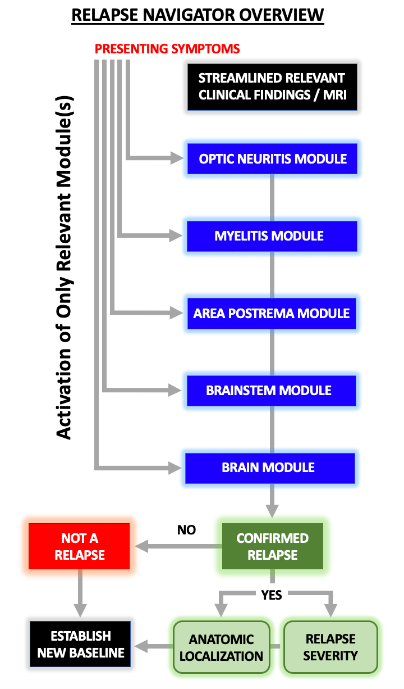

# 1. Relapse Adjudication: Overview of Relapse Navigator 

This reference manual explains the overall rationale for and processes underlying the **_Relapse Navigator_**, an instrument designed to be an adjunct to clinical adjudication of acute neurological events that occur in patients with neuromyelitis optica spectrum disorder (NMOSD). Sections 1-4 outline the general process for relapse adjudication, including the integration of symptoms, clinical signs, and MRI data, as well as relapse localization and severity determination. Sections 5-9 outline the detailed assessment of a potential relapse in each of the 5 domains: optic nerve, spinal cord, area postrema, brainstem, and brain.

## Purpose

The purpose of the **_Relapse Navigator_** is to adjudicate potential clinical relapses that occur in subjects with NMOSD in the context of a clinical trial where such relapses are outcome events. Elements of the **_Relapse Navigator_** may be utilized in other settings such as specialty clinics in which longitudinal clinical assessments are desired.

## Objectives

The principal objectives of the **_Relapse Navigator_** are to aid in assessment of:

**A.** Adjudication of a clinical event to determine if new reported symptoms are associated with objective clinical signs and/or MRI findings meeting criteria for a relapse.

**B.** Localization of the symptoms to one or more of 5 neuroanatomically-defined regions affected by NMOSD (myelitis \[spinal cord\]; optic nerve, area postrema, brainstem and/or brain).

**C.** Severity of a confirmed relapse at each affected anatomic site based on comparison of the objective findings between the most recently recorded baseline examination prior to the relapse event and the examination performed at the time of the relapse.

## 1.1 Relapse Adjudication: Overview

Relapses indicate new CNS disease activity and are the most important outcome assessed in clinical practice and clinical trials. A NMOSD relapse is defined as a one or more new symptoms or a change in preexisting symptoms (a "clinical event") that are consistent with the known characteristics of disease activity, last for >24 hours, are associated with an associated new or worsening objective change in neurological examination and/or MRI findings, and lack a better causative explanation. To qualify as a relapse, a new clinical event must occur after 30 or more days of clinical stability following a prior relapse; by convention, symptoms and examination deficits occurring within 30 days of a prior relapse are considered as part of that prior relapse. However, if a clinical event was not judged to be a relapse and neurologic deficits worsened within 30 days of onset, the event can be re-adjudicated.

As illustrated in Figure 1, a new clinical event triggers activation of one or more of 5 neuroanatomically-defined **_Relapse Navigator_** modules, but only those relevant to the presenting symptoms. Algorithms within each activated module are used to determine if there is objective clinical examination change by assessment of a "targeted neurological deficit" (TND) related to the presenting symptoms, comparing results of a prior baseline examination to those associated with the new clinical event. Thus, this "streamlined" process is designed to enhance the signal-to-noise ratio for relapse adjudication by examining only the TND and eliminating all data extraneous to the potential relapse in question. Some relapse definitions require MRI support by detection of new and/or gadolinium-enhancing lesions associated with the symptoms.

Two outcomes of relapse adjudication are possible: a clinical event is either a relapse or it is not. If a relapse is confirmed, the anatomic site(s) involved are recorded and an assessment of relapse severity is made. Regardless of the final adjudication result, a subsequent clinical examination is recommended to re-establish the neurological examination baseline (the recommended time frame is 30 or more days after the most recent clinical event but can be defined by a clinical trial protocol).

**Figure 1.** Overview: **_Relapse Navigator_** Adjudication Modules and Process

## 1.2 Interpretation of Clinical Signs and Symptoms

Adjudication of a NMOSD relapse requires both subjective symptoms and objective evidence that supports the new symptoms are owing to the occurrence of new disease activity rather than another cause. The subjective information is the report of a new "clinical event", which a set of new or changed symptoms that are plausibly consistent with a NMOSD relapse. The objective evidence may include a predefined amount of objective clinical evidence (new clinical signs), by MRI evidence (new or enhancing lesions), or both.

For reasons only partially understood, there is a strong predilection for the optic nerve, spinal cord and brainstem, especially the dorsal medulla/area postrema. Furthermore, each involved site may be associated with diverse symptoms of varying severity. For example, a myelitis event may present with one or more of motor weakness, sensory impairment, or sphincter dysfunction. An optic neuritis event may cause decreased visual acuity, complete vision loss, or change in visual fields that are quantifiable for relapse adjudication. However, myelitis may also present with isolated neuropathic pain or other sensory symptoms that may not be associated with examination change but are nonetheless important in triggering an evaluation for a relapse. Similarly, optic neuritis may present with characteristic pain with eye movement but without symptoms or visual signs. Area postrema syndrome results in symptoms but no quantifiable objective findings and adjudication is based on the occurrence of typical symptoms of nausea, vomiting, or hiccups, clinical exclusion of other potential causes for the symptoms, and imaging support of a relevant new T2 or enhancing lesion in the dorsal medulla.

The relapse adjudication process broadly considers potentially relevant symptoms while recognizing that not every reported symptom is necessarily an indicator of a relapse. Clinical judgment is necessary; worsening of musculoskeletal aching pain is a nonspecific symptom and may reasonably be deemed not to be NMOSD relapse-related but if it occurs in combination with patient-perceived weakness, it may be sufficient to be deemed a clinical event for adjudication. A guiding principle for relapse adjudication is to err on the side of sensitivity (inclusion) in the interpretation of new symptoms with a relatively low threshold for triggering implementation of the adjudication process in order to not miss a possible relapse. On the other hand, greater specificity must be implemented at the stage of interpreting objective examination and MRI findings as this evidence is the critical component that determines if a clinical event is a true NMOSD relapse. In some instances, a clinical event may be deemed to be a pseudorelapse, denoting symptoms that do not reflect new CNS inflammation. Often, a pseudorelapse consists of nonspecific or non-localizing symptoms or worsening of a preexisting neurological deficit. For example, a patient with prior myelitis may have worsening of leg weakness in the context of a urinary tract infection or new musculoskeletal back pain may be associated with a change in ambulation. In these examples, there is a better explanation for the symptoms. Detection of one or more new T2 and/or new gadolinium enhancing MRI lesions required when it is difficult to assess for change in clinical status because of preexisting neurological deficits or when confident clinical adjudication of a relapse is not possible.

Presenting symptoms may be specific for a particular system. For example, monocular visual loss localizes to the optic nerve whereas a transverse truncal sensory level localizes to the spinal cord. In such instances, the **_Relapse Navigator_** activates the appropriate specific adjudication module. However, some symptoms are less specific, such as weakness of one limb or sensory loss in an arm and leg without an accompanying sensory level. In these situations, one needs to carefully consider whether the symptoms could be due to a spinal cord, brain, or brainstem lesion. Owing to the much higher prevalence of myelitis attacks, the **_Relapse Navigator_** defaults to the myelitis module in this scenario. However, if there is no corroborating evidence for a spinal cord relapse (i.e., negative spinal cord MRI), then adjudication as a possible brain or brainstem relapse, including evaluation of MRI scan of the brain, is appropriate, even when no other localizing symptoms of brain or brainstem involvement are present. Similarly, if weakness of one limb or sensory loss in an arm and leg without an accompanying sensory level occurred with a clinical indicator of a brainstem lesion, such as cranial neuropathy, or of a brain lesion, such as encephalopathy, adjudication as non-myelitis event in the first instance is most appropriate and only if that fails to reveal an explanatory lesion in the brain or brainstem is a myelitis evaluation performed. This approach assures that a comprehensive assessment of all potential relapse locations is completed for each clinical event, whether presenting symptoms have specific localizing value or not, and facilitates detection of multifocal relapses.

## 1.3 Interpretation of Neurological Examination Findings

### 1.3.1 Objective Examination Findings

The **_Relapse Navigator_** includes options for data entry at either Baseline and Relapse examinations. Baseline examinations are complete datasets (all examination components are required for all modules) and are recommended at study entry, at specific protocol-defined time points, and at post-relapse follow-up assessments. Most recovery from acute relapses occurs over a one-month period; assessment of recovery after a 30-day interval (and potentially after other defined interval durations) provides consistency rather than trying to assess "best recovery", but this process can be defined by a study protocol.

Once a relapse evaluation algorithm has been triggered by reported symptoms, adjudication is based on conservative interpretation of rigorously demonstrated clinical signs that are appropriate to the relapse type being considered and gathered at the time of the Relapse examination. Basic principles of interpretation of the neurological exam should be followed. For example, NMOSD affects the CNS, so the examination should focus on muscles that would be expected to be weak from an upper motor neuron lesion, such as finger extensors and ankle dorsiflexors. Deviations from this pattern (e.g., predominant plantar flexion weakness in a leg) should be considered a "red flag" and suggest that confounders such as pain may be influencing the neurologic examination or that an alternative diagnosis may be present (e.g., a pseudorelapse).

Objective clinical findings are required to adjudicate a relapse unless there are special circumstances. One example involves pain or sensory symptoms that are strongly suggestive of a new optic nerve or spinal cord relapse but without objective examination change. Another scenario is when preexisting neurological deficits, typically from prior myelitis, create "ceiling effects" or confound the examination increasing the chances of pseudorelapse. In these settings, MRI evidence is necessary and provides an objective substitute for the examination changes.

### 1.3.2 Targeted Neurological Deficit (TND)

The **_Relapse Navigator_** employs the concept of a targeted neurological deficit (TND). This means that assessment of relapse includes a tailored neurological examination that 1) is determined by the presenting symptoms, and 2) compares the current ("relapse") examination to a prior ("baseline") examination using raw examination data wherever possible. Note that the Baseline examination includes all examination elements for all modules (necessary to provide a reference for any type of future relapse). In contrast, Relapse examinations are limited in scope; symptoms of a clinical event trigger only the relevant **_Relapse Navigator_** module(s), each of which has a defined array of examination elements. For instance, new monocular visual impairment with eye pain activates the optic neuritis module and an assessment of visual acuity, visual fields, and pupillary light reflexes. No other elements of the examination are required because they will not contribute to relapse adjudication. Second, change in function in any limb or body part (e.g., motor weakness in a single extremity or sensory level on the trunk), if of sufficient severity, is capable of adjudicating an event as a relapse of any severity (mild, moderate or severe). Using raw or "unfiltered" examination data can limit false negative adjudications as compared with the approach of "filtering" exam data by first converting it to scores calculated with established scales (e.g., functional systems (FS) or Expanded Disability Status Scale (EDSS) of Kurtzke) and then comparing the relapse and baseline scores. This direct baseline-to-relapse raw data comparison reduces the risk of "ceiling effects" that limit responsiveness of exam change if a baseline FS score is high, a scenario most commonly occurring with optic neuritis or myelitis residual deficits. For example, a relapse causing measurable worsening of arm weakness in the setting of severe preexisting leg weakness may not result in a pyramidal FS score change. Similarly, loss of vision in a second eye is less sensitively measured by visual FS if a first eye is blind.

This TND approach has several implications that distinguish it from typical clinical trial outcome evaluations in NMOSD or multiple sclerosis, where complete neurological examinations are performed with every relapse assessment, most examination elements are converted to scores, and event and baseline scores are then compared to determine if there was a change. The advantages of the **_Relapse Navigator_** approach and use of the TND concept with unfiltered data include focused, clinical event-specific examinations that should have an enhanced signal-to-noise ratio (more likely to detect true change even with preexisting deficits), elimination of exam elements that do not influence adjudication, and more accurate assessment of relapse severity.

### 1.3.3 Threshold for Clinical Change

A clinician can be reasonably confident than a relapse has occurred when examination reveals that the current clinical deficit, relevant to the presenting symptoms, exceeds a threshold of unequivocal change in the from baseline. The clinical change threshold is defined as a certain magnitude of change from baseline and is specific to the type of relapse (e.g. spinal cord) and examination elements related to the presenting symptoms (e.g., motor, sensory, bowel and bladder, and gait functions). Other clues based on standard principles of neurological examination are also helpful. The presence of a combination of motor and sensory involvement with a pattern compatible and suggestive of spinal cord lesion (e.g., a "sensory level") and concomitant reflex changes (e.g., a new Babinski sign) provide strong objective support to a diagnosis of a relapse and this is reflected in the scoring thresholds of neurological findings in order to declare a relapse. Thus, the presence of mild weakness in two muscles group in one limb and a new Babinski sign may be considered a supportive of a relapse, while a similar change in strength without a Babinski sign may not be considered a relapse without imaging support. Similarly, re-emergence of previously documented objective neurological exam findings in the context of a new pneumonia may require ancillary testing to distinguish a relapse from a pseudorelapse. Relapse adjudication is based on integration of symptoms, signs and ancillary data as necessary. The presence of a conclusive new T2 or enhancing MRI lesion is a strong indicator that a relapse has occurred, although confounders exist (see section 1.3.1)

The threshold for clinical change that is sufficient for spinal cord relapse adjudication depends on whether the newly symptomatic limbs have been previously affected or not. There is greater propensity for pseudorelapse in patients if new symptoms occur exclusively in regions with residual deficits from prior myelitis. Therefore, such patients must have an MRI confirmation of a new explanatory cord lesion in order that the event be adjudicated as a relapse regardless of the degree of apparent examination change.

## 1.4 Interpretation of MRI Findings

### 1.4.1 New or Worsening T2 lesions

A new or enlarging T2 MRI lesion compared to a recent comparative MRI scan is a strong, albeit not absolute, indicator of a relapse. The location of the new lesion must be compatible with the presenting clinical symptoms and signs of the new clinical event. The presence of gadolinium enhancement at the same site adds substantially to the certainty that new or enlarging T2 lesions are responsible. Interpretation that a lesion is enlarging may be subject to misinterpretation because of technical differences and standardization of slice orientation, slice thickness and other technical aspects; these possibilities should be considered. The size of the lesion is also an important consideration. Larger lesions are more likely to represent clinically important lesions, but this is dependent on location, and small lesions in eloquent areas are capable of producing clinically important effects; hence a threshold for interpretation of T2 lesion based on size is not possible. Furthermore, new or enlarging T2 lesions or enhancement of the optic nerve may be undetectable on orbital MRI despite other compelling evidence of optic neuritis (e.g. visual loss and new ipsilateral optic nerve enhancement). It is important to consider the potential for confounding by known artifacts (e.g., FLAIR artifacts in periventricular areas; swallow artifacts on sagittal STIR images in the spinal cord), and MRIs should be interpreted at an experienced central site that applies criteria consistently to all study subjects. The pathology should be attributable to NMOSD relapse, and should not reflect another pathology (e.g., CNS infection, tumor), or be due to an "indirect effect" of NMOSD, such as hydrocephalus due to aqueductal stenosis. Image interpretation by MRI experts blinded to clinical data is the best strategy to determine whether a new or enlarging T2 lesion is detectable.

### 1.4.2 Gadolinium-Enhancing Lesions

New gadolinium enhancement at the site of a new T2 lesion or in a preexisting T2 lesion provides strong support that the lesion is "active" and consistent with a new relapse. Gadolinium enhancement detection is influenced by a variety of factors, including the interval between onset of symptoms and the MRI, technical factors including gadolinium dose and interval between administration and scanning, and whether or not treatment, especially corticosteroids, has been administered. If gadolinium enhancement is detected at a site lacking a T2 lesion, non-relapse explanations should be considered (e.g., venous angioma). At some sites that pose imaging challenges (e.g., optic nerve), isolated gadolinium enhancement in the context of consistent neurological symptoms may confirm a relapse. The extent and configuration of gadolinium enhancement may also be helpful (e.g., ring enhancement would be more convincing that a fleck of gadolinium enhancement). Ultimately, as with interpretation of T2 lesions, the opinion of a blinded MRI expert is the best guide as to whether a gadolinium-enhancing lesion is present and whether it convincingly supports a diagnosis of a relapse.

## 1.5 Integration of Symptoms, Examination and MRI Findings

For each type of potential relapse, a systematic evaluation of indicators of relapse must be completed, including:

**A.** presence of symptoms plausibly indicative of NMOSD relapse;

**B.** presence of objective exam findings that meet a specified clinical change threshold (except in special circumstances) and that are associated with the presenting symptoms;

**C.** in selected instances, whether MRI evidence (new/enlarging T2 or gadolinium enhancing lesions) satisfactorily explains the symptoms and is consistent with an NMOSD relapse rather than other pathology
