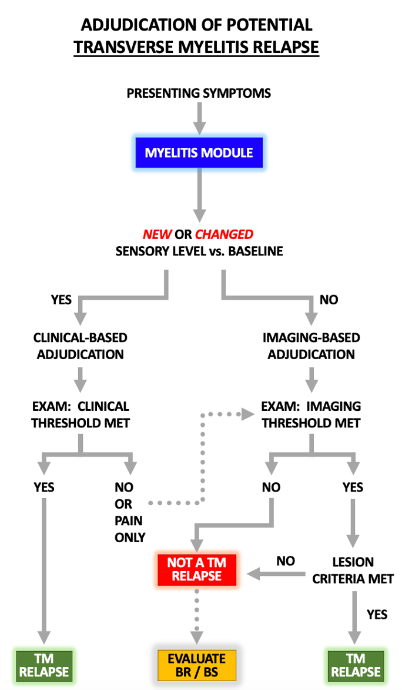
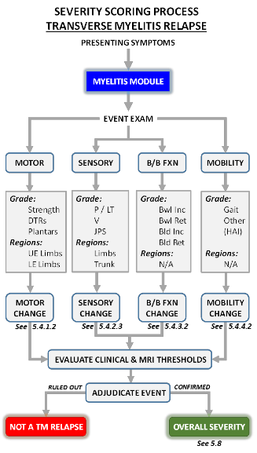

# 5. Relapse Assessment Module: Myelitis (MY; Spinal Cord)

## Figure 2. Summary of **_Relapse Navigator_** **_Myelitis_** Adjudication Module M1

## 5.1 Interpretation of Symptoms

Myelitis relapses in NMOSD may present with combinations of motor, sensory, and bowel/bladder symptoms and may affect gait. The primary motor symptom indicative of a relapse is muscle weakness in one or more limbs. Spasticity, gait impairment, and paroxysmal tonic spasms may accompany weakness but are considered sequelae rather than primary relapse indicators. Sensory complaints may be positive or negative symptoms involving one or more limbs and/or the trunk. A sensory level is a specific spinal cord-localizing sign, with a relatively abrupt alteration/reduction in pain and light touch sensation below a dermatomal level (and preserved sensation above that level) on one or both sides of the trunk. Positive symptoms include tingling, pain (electrical, lancinating, squeezing, or epicritic) or itching in a radicular, segmental, or spinal pattern (i.e., suggestive of a sensory level). Lhermitte's symptom may occur. Negative sensory symptoms also include limb sensory loss or clumsiness owing to impairment of spinothalamic or dorsal column function. Changes in bladder function include urinary frequency, urgency, hesitancy, retention or incontinence. Neurogenic bowel symptoms include urgency, constipation, or incontinence. Abnormal gait may occur as a result of a combination of sensory and motor dysfunction.

## 5.2. Myelitis Relapse Adjudication

The Myelitis module is the most complex of the Relapse Navigator modules owing to the need to integrate the many possible symptom combinations and their distributions (e.g., number of affected limbs). The TND principle is used to determine if there is examination change in motor function of one or more limbs, sensory functions of one or more limbs and/or the trunk, bowel or bladder symptoms, and gait. The severity of confirmed changes in each of these realms is, in turn, combined to determine overall relapse severity.

Myelitis relapses may be confirmed in two ways: on clinical grounds alone or with MRI support. A clinical event is eligible to be adjudicated with clinical evidence alone if presenting symptoms include a truncal sensory level (a specific localizing symptom), at least some of the presenting symptoms occur in spinal cord module systems that are normal at baseline, and enough of those symptoms are associated with new clinical signs meeting a change threshold. All other scenarios require confirmatory MRI evidence.

**Table 3. Clinical Versus MRI-Supported Myelitis Relapse Adjudication**

| Basis of Relapse | Clinically Supported | MRI Supported |
|-----------------|---------------------|---------------|
| **Relapse Definition** | Clinical only | Clinical plus MRI |
| **Eligibility: Presenting symptoms** | Spinal cord-specific symptom: **New or changed sensory level** | Any of the following: - New motor weakness- New limb sensory/pain syx - New neurogenic pain - New bladder/bowel symptoms - New gait change |
| **Eligibility: Baseline function** | **Baseline exam must be normal** **in the systems** (e.g. motor, sensory) **and regions** (e.g., specific limb(s), trunk) **implicated by new symptoms** | Baseline may be abnormal |
| **Required minimum clinical change from baseline exam ("threshold")** | **"Clinical threshold":** Clinical change below met **IF all affected areas normal at baseline** | **"MRI threshold":** Any clinical change below |
| **Thresholds: Summary** | 1 Moderate system change: [Motor or Sensory] OR 2+ Mild system changes [Motor or Sensory or B/B] | Varies based on System |
| **Thresholds: Details by System** | | |
| **Motor System** | | |
| Motor only | Moderate change | Mild change OR New extensor plantar response (normal baseline) ipsilateral to new motor complaints |
| Motor combination | Mild motor change PLUS [Mild sensory change and/or Mild B/B change] | N/A |
| **Sensory System** | | |
| Sensory only | Moderate change | Mild change |
| Sensory combination | Mild sensory change PLUS [Mild motor change and/or Mild B/B change] | N/A |
| **Bowel/Bladder System** | | |
| Bowel/Bladder only | N/A | Moderate change |
| Bowel/Bladder combination | Mild B/B change PLUS [Mild motor change and/or mild sensory change] | N/A |
| **Gait System** | | |
| | N/A | Ambulation index score increase by 1+ points if baseline > 2 |

### 5.2.1 Clinically–Supported Myelitis Relapse Adjudication

Myelitis relapse may be adjudicated on purely clinical grounds (i.e., without spinal cord MRI confirmation) if characteristics of the new clinical event meet ALL of the following criteria:

**1)** The clinical event includes symptoms consistent with a new or changed truncal sensory level, which is considered a specific spinal cord symptom, and that new or changed level is confirmed on clinical examination.

A sensory level is defined as follows:

- The patient reports new sensory changes below a certain level on one or both sides of the trunk
- A sensory level may be on one or both sides of the trunk
- If bilateral, the dermatomal level may differ between sides
- On examination, there is an abrupt increase in perception of pain or light touch sensation above a truncal dermatomal level (C2-L1 inclusive)

New sensory level: sensory symptoms reported on one or both sides of the trunk with documentation of a normal prior (baseline) exam for truncal pain/light touch sensation on the affected side(s)

Changed sensory level: sensory symptoms reported on one or both sides of the trunk with the upper border of the sensory level located 3 or more dermatomes above (cranial) to a previously documented (baseline exam) sensory level ipsilateral to the symptom(s)

**2)** One or more event symptoms (motor, sensory, bowel/bladder) occur in body regions or systems that have a normal baseline examination.

For example, if a patient has a normal baseline exam, all motor, sensory, and bowel/bladder symptoms and signs can contribute to adjudication. If a patient has baseline right leg weakness and sensory impairment, only new left leg motor or sensory symptoms and signs can be used to confirm a relapse on clinical grounds only. In other words, abnormal baseline findings can be present in limbs or functions that are not implicated in the new event.

**3)** Eligible symptoms (from criterion 2 above) are associated with examination abnormalities that exceed a defined threshold of clinical change from the normal baseline.

Clinically supported relapses require neurological examination evidence that exceed specific thresholds of change from normal baseline and affect regions of the trunk (documentation of a new or changed sensory level) plus and possibly motor or sensory function in one or more limbs or bowel/bladder system that were documented to be normal at baseline. Clinical events that meet criteria 1 and 2 but do not meet this clinical threshold should be reviewed as a potential MRI-supported relapse.

### 5.2.2 MRI-Supported Myelitis Relapse Adjudication

Spinal cord MRI is required to confirm a myelitis relapse in the following situations:

**1)** Presenting symptoms that result in Myelitis module assessment do not include a possible new or changed sensory level (i.e., all presenting symptoms are non-localizing)

**2)** Presenting symptoms of a new or changed sensory level (localizing signs) are not confirmed on examination (the clinical event therefore has no specific localizing signs).

**3)** All presenting symptoms are associated with baseline examination abnormalities.

**4)** Events otherwise eligible for clinical-supported myelitis adjudication are associated with examination changes that fail to meet thresholds for a clinically defined relapse but meet the lower threshold(s) required for MRI-supported relapse. This includes isolated radicular pain.

**Illustrative examples:**

A patient has history of one prior myelitis relapse that affected only the lower extremities.

**Situation 1**: She reports new isolated bilateral fingertip and lower extremity numbness.

Interpretation: The patient does not report spinal cord-localizing symptoms of a new or changed sensory level. Therefore, relapse adjudication requires both an assessment of whether her examination changed sufficiently from baseline and a spinal cord MRI.

**Situation 2**: She reports new left leg weakness and ascending numbness that started in the feet and has now reached the left knee and the right trunk at the T10 dermatomal level.

Interpretation: The patient's symptoms suggest a possible spinal sensory level. The adjudication process should therefore initially be based on the clinical criteria. Symptomatic regions (in this case, motor function in the left leg and sensory function in both legs and the trunk) that have a normal baseline exam are eligible to contribute to clinical adjudication. If exam change from normal baseline is sufficient to meet clinical thresholds in the affected regions, including objective confirmation of the suspected sensory level, a clinically supported relapse can be adjudicated. If the normal regions/systems do not change sufficiently to meet clinical thresholds, a clinical relapse cannot be confirmed; the next step would be to determine if any examination change is sufficient to permit use of an MRI to confirm the relapse.

## 5.3 Measurement of Objective Changes on Examination

Spinal cord relapses consist of varied contributions of motor and sensory symptoms and signs that involve 1-4 limbs and the trunk, bladder/bowel dysfunction, and gait changes. This symptom complexity and spatial heterogeneity can result in loss of informative data and resultant "false negative" assessments if motor and sensory examination data are transformed or "filtered" into summary FS scores. For example, in a patient with a baseline pyramidal FS score of 3 because of unilateral leg weakness, a new event may be associated with significant and objective worsening of strength in the contralateral leg, but the change may still be insufficient to result in an increased pyramidal FS score. To mitigate this problem, "unfiltered" neurological examination findings relevant to the presenting symptoms (the "targeted neurological deficit" or TND) are used to adjudicate spinal cord relapses to the extent possible. For the motor and sensory systems, this TND schema considers only detection of new event-related change from baseline in strength of affected limbs and sensation of affected limbs and the trunk. Preexisting deficits in other limbs are not factored into the assessment because they are not relevant to the current relapse assessment. Bowel and bladder and gait functions are assessed separately. The components of TND assessment for spinal cord relapses are summarized in Section 5.4.

## 5.4 Spinal Cord TND: Examination Elements and Assessment

### 5.4.1 Motor Function: Testing Elements and Methods

#### 5.4.1.1 Motor System Assessment: Change from Baseline for Symptomatic Limb(s):

Changes in motor system function are assessed for each limb and then those results are integrated to determine overall motor system change associated with a clinical event. Two special circumstances are noted below.

Determine the degree of motor change in each limb as follows:

**Mild Change**

- decrease in MRC grade by 1 point in 1-3 pyramidal muscle groups OR
- isolated new extensor plantar response*

**Moderate Change**

- decrease in MRC grade by 2 points in 1-2 pyramidal muscle groups OR
- decrease in MRC grade by >1 points in 1 or more non-pyramidal muscle groups*

**Severe Change**

- decrease in MRC grade by 3 points in 1 or more pyramidal muscle groups OR
- decrease in MRC grade by >2 points in 3 pyramidal muscle groups

*_Special circumstances_:

**1)** Motor symptoms and isolated new ipsilateral extensor plantar response

In a patient who reports new limb weakness but has no objective change in motor strength detected on examination, a new associated extensor plantar response ipsilateral to the symptomatic limb weakness is considered an objective sign of examination change. The plantar response change must be new and unequivocal; the baseline plantar response score must be 0 and the relapse exam plantar response score must be 2.

Interpretation of motor change: Confirmation of a new extensor plantar response is equivalent to mild change in motor function for the affected ipsilateral symptomatic limb(s).

**2)** Severe baseline motor deficits M3,M5

In some individuals with severe baseline motor deficits in pyramidal muscle groups, weakness caused by a new relapse may not be reliably detected because of a "floor effect". To mitigate this problem, the following non-pyramidal muscle groups will be tested in patients with baseline MRC scores of 2 or less in one or more pyramidal muscle groups in an affected limb:

- Upper extremity: biceps and finger flexors
- Lower extremity: knee extensors and ankle plantar flexors

Interpretation of motor change: Isolated decrease in MRC grade by >1 point in 1 or more non-pyramidal muscle groups is equivalent to moderate motor system change for that limb.

#### 5.4.1.2. Overall Motor System Change from Baseline

The overall change in motor function is used to determine the motor component of the composite TND myelitis relapse adjudication. It is derived by combining the motor changes detected in each individual limb:

**Mild overall motor system change** (grade 1 severity):

- Mild motor system changes in 1-2 limbs

**Moderate overall motor system change** (grade 2 severity):

- Moderate motor system changes in 1-2 limbs OR
- Mild motor system change in 3-4 limbs

**Severe overall motor system change** (grade 3 severity):

- Severe motor system changes in 1 or more limbs OR
- Moderate motor system changes in 3-4 limbs OR
- Neurogenic respiratory symptoms requiring ventilatory support

### 5.4.2 Sensory Function

Sensory examination changes that correspond to presenting symptoms may include single or multiple limb myelopathic patterns (e.g., variations of Brown-Sequard syndrome) and radicular, segmental, and truncal sensory level patterns. Sensory impairment is graded as normal, mild, moderate, marked, or complete loss for each of the symptoms of pain/light touch, vibration, and proprioception.

#### 5.4.2.1 Sensory Function: Testing Elements & Methods

**A. Limb testing: pain/light touch, vibration, proprioception modalities**

**A.1 — Pain/Light Touch:** M10

Rate if any segment of the body larger than 50 cm2 is affected; use pin and pinhead for testing sharp/dull and light touch of fingertip for light touch.

1. Normal
2. **Mild**: Subjective alteration of sensation but consistently identifies (&lt;10% incorrect responses) light touch and discriminates sharp from dull
3. **Moderate**: Occasional errors (10-30% incorrect responses) in identifying light touch or discriminating sharp from dull
4. **Marked**: Frequent errors (30-50% incorrect responses) in identifying light touch or discriminating sharp from dull
5. **Complete Loss (Severe)**. Consistently unable to identify light touch or discriminate sharp from dull

**A.2 — Vibration:** M8

Test each limb with 128 Hz tuning fork.

1. **Normal**
2. **Mild**: Detection of &lt;10 seconds at distal interphalangeal (DIP) joint of toe or finger
3. **Moderate**: Complete loss of vibration sense at DIP joint of toe or finger; able to perceive some vibration at ankle or wrist
4. **Marked**: Complete loss of vibration sense at ankle or wrist; able to perceive some vibration at knee or elbow
5. **Complete Loss (Severe)**: Complete loss of vibration sense at knee or elbow

**A.3 — Proprioception** M9

1. **Normal**
2. **Mild**: More than 30% incorrect responses with small movements (less than 0.5 cm) of DIP joints at toe or finger.
3. **Moderate**: More than 30% incorrect responses with large movements (2-3 cm) of DIP joint of fingers or toes.
4. **Marked**: More than 30% incorrect responses with small movements at ankles or wrists.
5. **Complete Loss (Severe)**: More than 30% incorrect responses with large movements of wrists and ankles or some incorrect responses with small movements at knee or elbow.

**B. Trunk: Pain / Light Touch Sensation** M11

- Sensory level or segmental loss (graded as moderate)

Examine for sensory level and otherwise rate if any segment of the body larger than 50 cm2 is affected; use pin and pinhead for testing sharp/dull and cotton wool or fingertip for light touch.

0\. **Normal**

1\. **Mild**. Subjective alteration of sensation but consistently identifies (&lt;10% incorrect responses) light touch and discriminates sharp from dull

2\. **Moderate**. Objective evidence of deficit; occasional errors (10-30% incorrect responses) in identifying light touch or discriminating sharp from dull

3\. **Marked**. Frequent errors (30-50% incorrect responses) in identifying light touch or discriminating sharp from dull

4\. **Complete Loss (Severe)**. Consistently unable (90% or more trials) to identify light touch or discriminate sharp from dull

#### 5.4.2.2. Sensory System Assessment: change from baseline for each symptomatic limb and the trunk

Changes in sensory system function are assessed for the trunk and each limb and then those results are integrated to determine overall sensory system change associated with a clinical event.

**Mild change**

Any of:

- 1 grade decrease in pain sensation in 1-2 limbs and/or the trunk
- 1 grade decrease in proprioception in 1-2 limbs
- 2 grade decrease in vibration in 1-2 limbs
- Dermatomal/segmental pain only (see special circumstance below)

**Moderate change**

Any of:

- 2 grade decrease in pain sensation in 1-2 limbs
- 2 grade decrease in proprioception in 1-2 limbs
- 3 grade decrease in vibration in 1-2 limbs (or complete loss if baseline = moderate loss)
- Combination of >2 mild changes in 3-4 limbs and/or the trunk

**Severe change**

Any of:

- 3 grade decrease in pain sensation in 1-2 limbs and/or the trunk
- 3 grade decrease in JPS in 1-2 limbs
- Combination of 2+ moderate changes in 3-4 limbs

#### 5.4.2.3 Special Circumstances

Detection of examination changes in the sensory system may be difficult owing to the subjective nature of both the symptoms and the interpretation of the examination. For compelling clinical presentations of a sensory/pain syndrome compatible with NMOSD disease activity (e.g., new and severe radicular, segmental/dermatomal pain with neuropathic characteristics and no other cause detected) but no changes in the sensory examination, a spinal cord MRI may be obtained, and the potential relapse adjudicated using the MRI-supported pathway within the myelitis relapse adjudication algorithm. This situation is an exception to the objective examination change requirement that governs the relapse adjudication process. Clinical change in the sensory system should be denoted as 'mild' for purposes of relapse adjudication and severity assessment.

#### 5.4.2.4. Overall Sensory System Change from Baseline

The overall change in sensory function is used to determine the sensory component of the composite TND myelitis relapse adjudication. It is derived by combining the sensory changes detected in each individual limb and the trunk:

**Mild** (grade 1 severity):

- Mild sensory system changes in 1-2 limbs/trunk

**Moderate** (grade 2 severity):

- Moderate sensory system changes in 1-2 limbs/trunk
- Mild sensory system change in 3-4 limbs/trunk

**Severe** (grade 3 severity):

- Severe sensory system changes in 1 or more limbs/trunk
- Moderate sensory system changes in 3-4 limbs/trunk

### 5.4.3 Bladder and Bowel Function

#### 5.4.3.1 Elements and Assessment

Assign a grade using the following scale:

1. **Normal**
2. **Mild**:

- urinary urgency or hesitancy (but still able to void spontaneously and no incontinence); or
- mild constipation

1. **Moderate**:

- urinary urgency with incontinence (less than daily); or
- moderate hesitancy causing difficulty with spontaneous voiding (e.g., need for Crede maneuver); or
- occasional (less than daily) bowel incontinence

1. **Severe**:

- urgency associated with daily incontinence and/or requiring any new intermittent catheterization, or
- urinary retention requiring new intermittent catheterization

1. **Complete Loss of Function**

- requires indwelling urinary catheter; or
- complete bowel incontinence/loss of bowel function

#### 5.4.3.2 Overall Bowel and Bladder System Change from Baseline

**Mild**: increase by 1 grade (grade 1 severity)

**Moderate**: increase by 2 grades (grade 2 severity)

**Severe**: increase by 3+ grades (grade 3 severity)

### 5.4.4 Gait

#### 5.4.4.1 Elements and Assessment

Assessment: Assign a grade from 0-9 based upon a combination of patient/caregiver report and neurological examination using the Hauser Ambulation Index.

**Hauser Ambulation Index**

**0** = Asymptomatic; fully active.

**1** = Walks normally, but reports fatigue that interferes with athletic or other demanding activities.

**2** = Abnormal gait or episodic imbalance; gait disorder is noticed by family and friends; able to walk 25 feet (8 meters) in 10 seconds or less.

**3** = Walks independently; able to walk 25 feet in 20 seconds or less.

**4** = Requires unilateral support (cane or single crutch) to walk; walks 25 feet in 20 seconds or less.

**5** = Requires bilateral support (canes, crutches, or walker) and walks 25 feet in 20 seconds or less; _or_ requires unilateral support but needs more than 20 seconds to walk 25 feet.

**6** = Requires bilateral support and more than 20 seconds to walk 25 feet; may use wheelchair* on occasion.

**7** = Walking limited to several steps with bilateral support; unable to walk 25 feet; may use wheelchair* for most activities.

**8** = Restricted to wheelchair; able to transfer self independently.

**9** = Restricted to wheelchair; unable to transfer self independently.

*Note: use of a wheelchair may be determined by lifestyle and motivation. It is expected that patients in Grade 7 will use a wheelchair more frequently than those in Grades 5 or 6. Assignment of a grade in the range of 5 to 7, however, is determined by the patient's ability to walk a given distance, and not by the extent to which the patient uses a wheelchair.

#### 5.4.4.2 Overall Gait System Change from Baseline

**Mild**: increase by 1 grade (grade 1 severity)

**Moderate**: increase by 2 grades (grade 2 severity)

**Severe**: increase by 3 or more grades (grade 3 severity)

## 5.5 Thresholds for Objective Changes on Examination In Relapse Adjudication

Myelitis relapse adjudication requires new symptoms that are associated with objective changes in the neurological examination that reach a defined minimum threshold. The **_Relapse Navigator_** defines two distinct threshold types relevant to myelitis: the clinical threshold (for clinically-supported relapse adjudication) and the MRI threshold (for MRI-supported relapse adjudication). The degree of change in each of the relevant motor, sensory, bowel and bladder, and gait systems is used to determine whether any exam thresholds have been met.

### 5.5.1 Thresholds for Clinically-Supported Relapse

The clinical threshold represents the degree of change in spinal cord function sufficient to confirm a relapse on the basis of clinical information alone (i.e., without adjunctive MRI evidence). As outlined in Section 4.2, this can only occur if there is a new or changed spinal sensory level and must be based on examination changes that were normal at baseline.

The clinical threshold for a transverse myelitis relapse requires documentation of at least 1 of the following examination changes from baseline:

**1)** **Mild** (only for MRI-supported relapse—see below)

**2)** **Moderate** (grade 2) overall motor change

**3)** **Moderate** (grade 2) overall sensory change

**4)** At least 2 of the following 3 changes

- **Mild** (grade 1) overall motor change
- **Mild** (grade 1) overall sensory change
- **Mild** (grade 1) overall bladder/bowel grade change

### 5.5.2 Thresholds for MRI-Supported Relapse

The MRI thresholds are defined as the minimal clinical change to:

1. allow adjunctive spinal cord MRI to be obtained in a patient who was originally eligible for a clinically supported myelitis attack adjudication (new/changed spinal sensory level and at least some elements of the presenting symptoms associated with normal baseline examination) but in whom clinical thresholds were not met;
2. determine if sufficient objective examination change occurred to adjudicate an MRI-supported myelitis relapse

Transverse myelitis (spinal cord) MRI thresholds include any of the following:

1. **Mild**

(grade 1) overall motor change; or

(grade 1) overall sensory change or unexplained dermatomal/radicular pain; or

(grade 1) increase in Hauser Ambulation Index (permitted only if the baseline AI score = 2 or greater)

2) **Moderate** (grade 2) change in overall bladder/bowel grade

## 5.6 Integrating Symptoms, Exam Thresholds and MRI Findings

For patients whose events are eligible for clinically-supported relapse adjudication, demonstration that the symptoms are associated with objective exam change that meets a minimum clinical threshold is sufficient to confirm a relapse.

For patients 1) who require an MRI for relapse adjudication eligibility, or 2) whose events were clinically eligible, but the degree of objective exam change did not meet a clinical threshold, meeting the minimum MRI threshold is required to proceed to MRI evaluation and full adjudication. If the MRI threshold is not met, the event is not a relapse.

If the MRI threshold is met, and one or more new MRI lesions (as per section 1.3) is detected in the spinal cord, the MR findings must be correlated with the symptoms to determine that they satisfactorily explain the presenting clinical syndrome (e.g., appropriate laterality). Also, the lesions must be determined to be consistent with myelitis and not an alternative pathology (e.g., an extra-axial lesion would not be consistent with myelitis). Cervical and thoracic spinal cord MRI that includes T2 and T1 sequences (the latter with gadolinium administration) in both sagittal and axial planes should be performed in all patients requiring confirmatory MRI data. One or more of the following findings are required to confirm the presence of a new relapse-related lesion: 1) new T2 cord lesion; 2) unequivocally enlarged T2 cord lesion, or 3) a lesion that enhances after gadolinium enhancement that was not present on a prior scan. If the MRI does not demonstrate such lesions, the event is not a relapse or requires further evaluation via the Brain and Brainstem module, directly with brain MRI when no other brain- or brainstem-specific symptoms are identified and when a sensory level/change in sensory level is absent (see Figure). If a sensory level is present, a brain or brainstem lesion could not explain the findings. If there are lesions present that fully explain the presenting symptoms, then an MRI-supported relapse is confirmed. If only a portion of the presenting symptoms and signs are explained by the detected lesion(s), further evaluation via the Brain and Brainstem module and with brain MRI may be required (see Figure 2A and 2B).

## 5.7 Myelitis Relapse Severity Scoring

### Figure 3. Overview of Relapse Navigator **_Myelitis_** Module Severity Score

**Legend for Figure 5.7**: Abbreviations used: DTRs, deep tendon reflexes; UE, upper extremity; LE, lower extremity; P/LT, pain/light touch; V, vibration; JPS, joint position sense (proprioception); Bwl Inc, bowel incontinence; Bwl Ret, bowel retention; Bld Inc, bladder incontinence; Bld Ret, bladder retention; HAI, Hauser ambulation index;

Once a myelitis relapse is confirmed, its severity is graded using a composite measure of the degree of change in each of the contributing subsystems (motor, sensory, bladder/bowel). The overall change scores for each subsystem TND (mild = 1, moderate = 2, severe = 3) are applied as follows to grade relapse severity:

Composite-Based Scale:

- **Mild**: one or two grade 1
- **Moderate**: one or two grades 2 OR 3 grades 1
- **Severe**: one or more grades 3 OR three grades 2

For relapses adjudicated based on gait subsystem change alone, the overall gait change severity score indicates the relapse severity:

Gait-Based Scale:

- **Mild**: increase by 1 gait grade
- **Moderate**: increase by 2 gait grades
- **Severe**: increase by 3 or more gait grades
