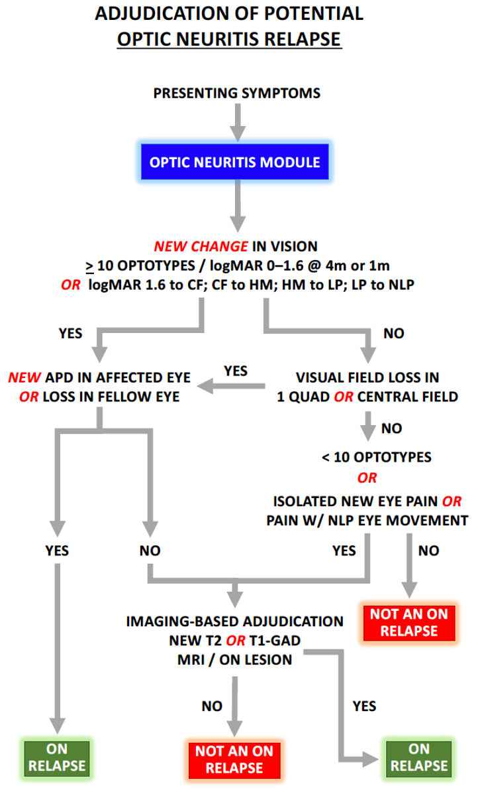

# 6. Relapse Assessment Module: Optic Nerve (ON; Optic Neuritis)

## Figure 4. Summary of **_Relapse Navigator Optic Neuritis_** Adjudication Module O1

### 6.1 Interpretation of Symptoms

Optic neuritis (ON) is one of the two commonest NMOSD relapse types. It typically presents with new eye pain (usually worsened with eye movement) and ipsilateral visual loss which manifest as reduced visual acuity, visual field impairment, or impaired color vision, occurring in isolation or in combination, and usually worsening over hours to days. However, absence of eye pain does not exclude ON and one or both eyes may be affected during a single ON relapse.

Sudden and complete vision loss within minutes to a few hours, changes in color vision alone, pain in the orbital or temporal parts of the skull or visual field changes alone that do not affect central vision are less likely to result from optic neuritis and may initiate diagnostic procedures to rule out an alternative cause (glaucoma, non-arteritic anterior ischemic optic neuropathy, compression of the optic nerve or chiasm, a brain lesion including a cerebral infarct causing a visual field deficit) that may occur in an NMOSD cohort. In the setting of a clinical trial, a baseline ophthalmological examination is recommended to document preexisting deficits and to identify concurrent ophthalmologic conditions that if overlooked may confound relapse assessment during the course of the trial.

Optic neuritis relapses may be confirmed exclusively on clinical grounds or with supporting MRI evidence. Symptoms such as new eye pain or central or peripheral visual impairment, occurring alone or in combination, are specific localizing symptoms that activate the ON relapse algorithm. Clinically supported ON is confirmed when the symptoms, plus visual exam findings exceeding a predefined threshold of central visual loss, are accompanied by either a new afferent pupillary defect (APD) in the newly affected eye or loss of a previously documented APD in the fellow eye. These APD status changes are sensitive indicators of altered afferent conduction in the symptomatic optic nerve. Alternatively, some ON relapses may be confirmed with MRI evidence of a new T2 lesion or T1 gadolinium enhancing lesion in the appropriate part of the anterior visual pathway.

### 6.2 Measurement of Objective Changes on Examination O2,O3

The Landolt C-ring high contrast visual acuity (HCVA) chart is the preferred method to assess visual acuity and is strongly recommended in the context of a clinical trial. However, visual acuity measurements may be utilized in retrospective studies when visual acuity has been recorded using other acuity charts (see Table). Patients should be evaluated using best visual acuity correction, either with glasses or with a pinhole, and the method of correction should be recorded and used consistently at each study visit. The Landolt C-ring HCVA chart consists of 14 lines, each containing 5 C-shaped optotypes. Each C-shaped open ring has one opening located on the top, bottom, right side, or left side of the ring and patients are asked to identify the position of the opening for each optotype. The HCVA chart should be read at 4m if the patient is able to identify at least 3 optotypes on the chart at that distance with best visual correction for that eye. In the

### 6.3 Visual Acuity in Relapse Navigator

The 4m visual acuity testing includes only the top 11 lines (55 optotypes) of the full 14 line chart, encompassing visual acuity from logMAR 1.0 to 0 (equivalent to the 20 foot range assessment of 20/200 to 20/20). At 4m distance, the bottom 3 lines (smallest 15 optotypes; logMAR -0.1 to -0.3 or 20/16 to 20/10) are excluded.

If the patient is unable to identify 3 optotypes at 4m distance, then the chart should be read at 1m distance with best visual correction for that eye. The top 6 lines, consisting of the 30 largest optotypes are used to assess visual acuity at the 1m distance that can be read at 1m. These 6 lines, which are associated with visual acuity of logMAR 1.0 to 0.5 at 4m, translates to visual acuity at 1m of logMAR 1.6 to 1.1. Table 3 demonstrates the conversion.

Best corrected visual acuity and the chart distance used are recorded for each eye. The patient is only given credit for a line of acuity if they successfully read at least 3 of 5 optotypes on the line. Therefore, 53 optotypes read on the 4 m chart would be converted to a measure of logMAR 0.0; however, 52 optotypes would be converted to logMAR 0.1.

If a patient is unable to read the 3 characters on the 1 m chart, the visual acuity should be identified categorically as follows, reflecting stepwise worsening in visual acuity: able to count fingers (CF); able to distinguish hand movement (HM), able to perceive light (LP), has no light perception (NLP).

| **Table 3: Interconversion of Visual Acuity** O4 |     |     |     |     |     |     |
| --- | --- | --- | --- | --- | --- | --- |
| **Landolt C Ring Chart (Line; top or largest is line 1)** | **Foot** | **Meter** | **Decimal** | **LogMAR** | **Landolt C optotypes** **(4 m chart)** | **Landolt C optotypes** **(1 m chart)** |
| **1** | **20/800** | **6/240** | **0.025** | **1.60** |     | **3-7** |
| **2** | **20/640** | **6/192** | **0.031** | **1.50** |     | **8-12** |
| **3** | **20/500** | **6/150** | **0.04** | **1.40** |     | **13-17** |
| **4** | **20/400** | **6/120** | **0.05** | **1.30** |     | **18-22** |
| **5** | **20/320** | **6/96** | **0.062** | **1.20** |     | **23-27** |
| **6** | **20/252** | **6/76** | **0.08** | **1.10** |     | **28+** |
| 1   | 20/200 | 6/60 | 0.10 | 1.00 | 3-7 |     |
| 2   | 20/160 | 6/48 | 0.125 | 0.90 | 8-12 |     |
| 3   | 20/125 | 6/38 | 0.16 | 0.80 | 13-17 |     |
| 4   | 20/100 | 6/30 | 0.20 | 0.70 | 18-22 |     |
| 5   | 20/80 | 6/24 | 0.25 | 0.60 | 23-27 |     |
| 6   | 20/63 | 6/19 | 0.32 | 0.50 | 28-32 |     |
| 7   | 20/50 | 6/15 | 0.40 | 0.40 | 33-37 |     |
| 8   | 20/40 | 6/12 | 0.50 | 0.30 | 38-42 |     |
| 9   | 20/32 | 6/9.5 | 0.63 | 0.20 | 43-47 |     |
| 10  | 20/25 | 6/7.5 | 0.80 | 0.10 | 48-52 |     |
| 11  | 20/20 | 6/6 | 1.00 | 0.00 | 53-55 |     |

**_Note_**: Use Landolt C ring 1 m chart for VA 1.1-1.6 (values in red) and Landolt C ring 4 m chart for VA 0.0 through 1.0.

O5 The examiner should record whether there is loss of vision by assessing the visual fields by confrontation using either finger counting or a 5 mm diameter pinhead (preferably red in color to optimize sensitivity). Quadrantic peripheral or central field loss should be recorded only when the majority of a given quadrant or sector is unable to perceive a 5 mm pinhead or there is a total inability to count fingers accurately in a quadrant. For patients with LP only or NLP, all central and peripheral fields for the affected eye(s) will be automatically recorded as abnormal regardless of whether the exam is done for baseline or relapse adjudication purposes.

O6 The patient should be assessed for presence of a relative APD using the swinging light test on each eye. A relative APD is recorded as present or absent and is not otherwise graded. If present, the affected eye is recorded (a relative APD cannot be bilateral). Only definite changes should be recorded, and not pupillary changes that can be attributed to hippus.

### 6.4 Clinical Thresholds for Objective Changes on Examination

Any of the following objective exam findings alone or in combination together with fulfillment of either the APD criterion or evidence of a new or enhancing MRI optic nerve lesion is sufficient to adjudicate an optic neuritis relapse:

1. Decrease of 10 or more optotypes from baseline on Landolt C-ring HCVA chart in the affect eye(s)
2. If baseline logMAR vision is 1.6 (20/800 equivalent) or worse, a decrease by 1 or more category steps (possible 1-step changes: logMAR 1.6 to CF, CF to HM, HM to LP, LP to NLP)

### 6.5 MRI Assessment

MRI should be performed whenever the APD criteria are not fulfilled AND either:

1. the threshold of 10 optotype change (or 1 category step change when baseline visual acuity is worse than logMAR 1.6) is exceeded; or
2. If baseline logMAR vision is 1.6 (20/800 equivalent) or worse, a decrease by 1 or more category steps (possible 1-step changes: logMAR 1.6 to CF, CF to HM, HM to LP, LP to NLP), OR
3. the patient has new eye pain consistent with ON

A positive MRI result supports an ON relapse in conjunction with the clinical symptoms and objective exam findings listed above. A positive MRI result is achieved with demonstration of one or both of the following:

**1)** A new gadolinium-enhancing lesion in any part of the optic nerve or optic chiasm on axial and sagittal post-contrast T1-weighted sequence

**2)** A new lesion in any part of the optic nerve or optic chiasm on at least 2 of 3 of the axial/sagittal/coronal T2-weighted sequence

The application of the "new T2 lesion" criterion requires a previous MRI for comparison. The lesion should be consistent with ON and not a different pathology such as tumor, sarcoidosis or other pathology.

### 6.6 Optic Neuritis Relapse Severity Scoring

If ON relapse is adjudicated, the event is classified as mild, moderate, or severe based on whether visual acuity has worsened sufficiently to increase into a higher quintile. Quintiles are defined accordingly:

Quintile 1: logMAR = 0.1-0.4 (20/25 to 20/50)

Quintile 2: logMAR = 0.5-0.8 (20/63 to 20/125)

Quintile 3: logMAR = 0.9-1.2 (20/160 to 20/320)

Quintile 4: logMAR = 1.3-1.6 (20/400 to 20/800)

Quintile 5: logMAR > 1.6 (includes CF, LP, HM and NLP)

Relapse severity is categorized as follows:

- **Mild**: change by 1 category/quintile or less
- **Moderate**: change in 2 categories/quintiles
- **Severe**: change in 3 or more categories/quintiles OR change from CF to NLP

Example: a patient has residual visual acuity of 0.3 logMAR (20/40) in his right eye from a previous ON relapse and has a right relative APD. He now reports further decline in vision in that eye with new eye pain. Visual acuity has now declined to 1.6 logMAR (20/800) and a right APD is still present. Since there is no change in the APD, an MRI is required for adjudication. MRI shows a new enhancing lesion in the right optic nerve, confirming a new right ON relapse. The visual acuity has changed from the 1st to the 4th quintile (change of 3 categories), and the relapse is rated as "severe."

Quintile 3 spans the 1m and 4m charts. This should not impact the automated system from calculating longitudinal change based on the use of dummy variables that track an inferred total optotype count (numeric variable) and 5th quintile measure (text variable: CF, HM, LP, NLP). The investigator records only the chart distance and the optotypes counted by the subject.
