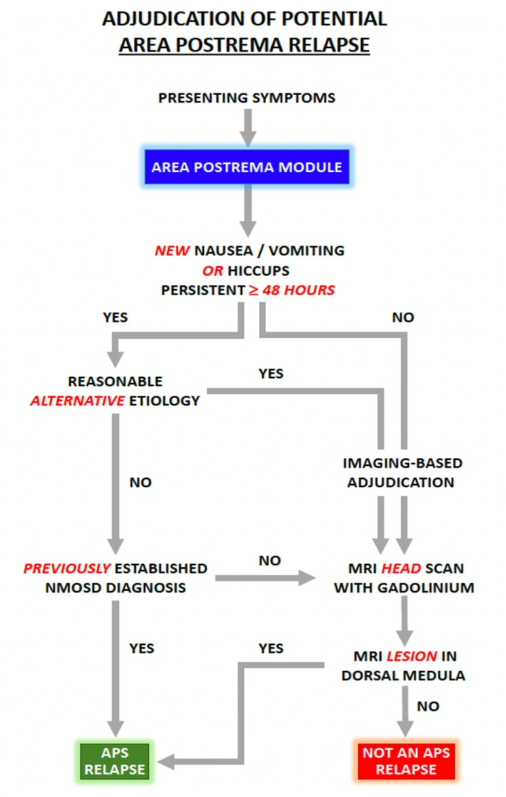

# 7. Relapse Assessment Module: Area Postrema Syndrome (AP)

## Figure 5. Summary of Relapse Navigator Area Postrema Adjudication Module A1

The area postrema syndrome (APS) refers to nausea, vomiting, or hiccups associated with a lesion in the area postrema (the "vomiting center") of the dorsal medulla. This syndrome is the third most common type of clinical relapse in NMOSD with AQP4-IgG after optic neuritis and acute transverse myelitis.

## 7.1 Interpretation of Symptoms

### 7.1.1. Nausea

Nausea is a subjective sensation of impending vomiting. It has many and diverse etiologies ranging from central causes, including increased intracranial pressure and area postrema syndrome; vestibular dysfunction; gastrointestinal; metabolic and biochemical; associated with migraine; and psychiatric (e.g., bulimia). Nausea is a common, usually self-limited symptom ("gastroenteritis") and often a specific cause is not found. However, it is a cardinal feature of an area postrema relapse in NMOSD with AQP4-IgG. Characteristics of nausea that suggest it is likely caused by an area postrema lesion include duration >48 hours (often days to several weeks), intractability, and lack of alternative explanations. Nausea related to a NMOSD relapse may be episodic or continuous. APS symptoms respond inconsistently to anti-nausea treatments but reliably to corticosteroid treatment.

### 7.1.2 Vomiting

The occurrence of vomiting confirms that purported nausea is indeed nausea. Unlike nausea, vomiting occurs in discrete and countable events.

### 7.1.3 Hiccups

Hiccups are myoclonic contractions of the diaphragm. Causes of hiccups are diverse, including central, gastrointestinal, metabolic disorders, infiltrative and other structural lesions that irritate the vagus or phrenic nerves. However, common causes are overeating, swallowing air, emotional stress and eating certain foods and drinks, such as carbonated beverages. Intractable persistent and continual hiccups are more likely to indicate a serious cause as an irritative lesion of vagus or phrenic nerves or a central nervous system cause. In the context of APS, hiccups typically present at the same time as nausea and vomiting but may occur in isolation or can occur before or after; they can be intermittent or persistent over the duration of the relapse and resolve with time and/or treatment.

## 7.2 Clinical Thresholds

A clinical diagnosis of an APS relapse requires all of the following:

1) at least 1 of 3 symptoms (nausea, vomiting, or hiccups) lasting 48 hours or longer

2) lack of red flag indicators of an alternative cause

3) occurrence in the context of a well-established diagnosis of NMOSD with AQP4-IgG

The rationale for a clinical diagnosis of APS is that in the absence of other historical and clinical indicators of an alternative etiology, a transient period of intractable nausea, vomiting, or hiccup is a sufficiently characteristic syndrome that it can be reasonably ascribed to an NMOSD relapse. However, clinicians and investigators should err on the side of conservatism, and any potential indicator of an alternate etiology should be sufficient to require MRI imaging.

## 7.3 MRI Thresholds

In a clinical trial setting, symptom duration is a less helpful arbiter of APS relapse occurrence because patients may present early and a decision about diagnosis and implementation of treatment needs to be made immediately. In that situation, with less than 48 hours of new symptoms, MRI is required to detect a new dorsal medullary lesion supportive of APS.

If the rigorous clinical criteria outlined above are not met, a confirmatory brain MRI should be performed in NMOSD patients with suspected APS. Imaging abnormalities include new FLAIR/T2 lesions (typically paired and symmetric), sometimes accompanied by gadolinium enhancement, in the dorsal medulla in the floor of the 4th ventricle. Alternatively, lesions may extend from a myelitis lesion rostrally into the dorsal medulla. Lesions should ideally be evident on both sagittal and axial images. The possibility of FLAIR artifact should be considered especially when lesions are not evident on both sagittal and axial images and when only visible on FLAIR and not on other T2-weighted sequences.

## 7.4 Criteria for Area Postrema Syndrome Relapse

**1.** New nausea AND/OR vomiting AND/OR hiccup*

**2.** Persistent symptoms ≥48 hours**

**3.** Exclusion of other etiology***

* Nausea or hiccup may begin acutely or subacutely and be episodic or continual.

**Shorter duration of symptoms would be considered as a relapse if brain MRI shows a new area postrema T2 or T1 gadolinium-enhancing lesions and other causes are excluded

***Metabolic, gastrointestinal, infectious, biochemical, non-NMOSD CNS lesion, mediastinal lesion, classic migraine, psychiatric eating disorders, swallowing air, other.

## 7.5 Area Postrema Relapse Severity Grading

Severity of an APS relapse is determined by calculating the area postrema severity scale (APSS) score. The APSS is a composite measure that is based on the average frequency and duration of each symptom since onset. Unlike other systems (such as optic nerve and spinal cord), it is assumed that patients have baseline scores of zero (i.e., APS symptoms are absent). The score is determined at presentation based on patient self-report or observed vomiting/hiccups (e.g., if the patient is hospitalized). Different from the assessment of whether an event satisfies the clinical threshold for a relapse, where the total duration of symptoms is considered, the average duration of individual episodes (nausea, hiccups) or the number of episodes per day (vomiting) are considered. Weight loss is an indicator of severity and intractability but is an impractical arbiter of severity for a clinical trial because it is usually not evaluable when an APS relapse has started within the previous 48-72 hours.

## 7.6 Area Postrema Severity Scale (APSS)

### Symptom Grading

Area postrema relapse grading involves the individual and composite grading of nausea, vomiting and hiccups regarding duration or frequency as outlined below:

### 7.6.1 Nausea Grade (best estimate of average duration per day):

0: None/absent

1: Total episodic duration ≤ 3hrs

2: Total episodic duration 4-6hrs

3: > 6-hour episode or constant

### 7.6.2 Vomiting Grade: (best estimate of average number of episodes per day):

0: None/absent

1: ≤ 4 episodes / day

2: 5-7 episodes / day

3: > 7 episodes / day

### 7.6.3 Hiccups Grade: (best estimate of average duration per day):

0: None/absent

1: Total episodic duration < 3hrs

2: Total episodic duration 3-12hrs

3: > 12-hour episode or constant

### 7.6.4. Composite Score for Overall APS Relapse Severity

The overall APS relapse severity is determined by the number and degree of symptoms as follows:

**Mild**: one or two grade 1 symptoms

**Moderate**: one or two grade 2 symptoms or three grade 1 symptoms

**Severe**: one or more grade 3 symptoms or three grade 2 symptoms
