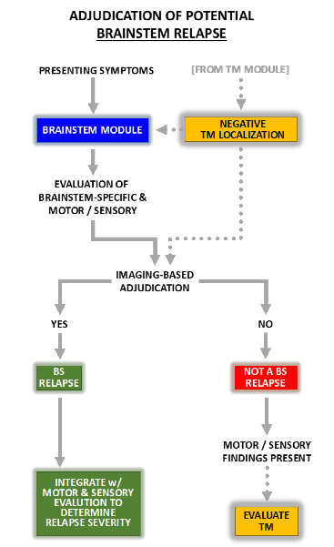

# 8. Relapse Assessment Module: Brainstem (BR; Non-APS Events)

## Figure 6.  Summary of Relapse Navigator Brainstem Adjudication Module  

## 8.1 Interpretation of symptoms

Brainstem relapses are relatively uncommon in NMOSD, although one multicenter study reported that 30% of patients had brainstem syndromes. Amongst brainstem syndromes, the APS is by far the commonest accounting for a third of cases; considering its frequency and uniqueness and general lack of association with other brainstem findings, a separate module is dedicated to it. In the rare event that a patient has symptoms of APS and other brainstem symptoms, completion of both relapse modules is required. Non-APS brainstem syndromes were diverse, the commonest being oculomotor disturbances (20% of cases with brainstem involvement) and pruritus (12%), although the latter is not specific for any neurological localization. Other syndromes such as hearing loss, facial weakness, vestibular disorders/vertigo, and trigeminal neuralgia each accounted for fewer than 3% of cases.

There are 7 brainstem symptoms and functions associated with **_Relapse Navigator_**, including: extraocular motor dysfunction (diplopia), nystagmus, trigeminal damage, facial weakness, hearing loss, dysarthria, and dysphagia. These symptoms are considered specific localizing symptoms and automatically trigger the brainstem module if they are included in the presenting symptoms of a new clinical event.

A brainstem syndrome may also manifest with long tract symptoms and signs (e.g., unilateral or bilateral limb weakness or sensory impairment) even without specific "cranial nerve" or other symptomatology indicative of a brainstem lesion. In such cases, a patient may first be evaluated for possible myelitis, the commonest localization for unilateral or bilateral weakness, but if no lesion is detected that would explain the patient's definite findings, then **_Relapse Navigator_** will request that a brain MRI be performed to detect either an acute brainstem or brain lesion that might explain the symptoms.

Although any symptom of a brainstem disorder could theoretically be attributed to NMOSD, given the relative rarity of brainstem relapses and the potential that the symptoms are due to a comorbid condition, supportive MRI evidence for a relapse is required for all events adjudicated in this module. Brain MRI is used to confirm the presence of a new brainstem lesion compatible with the presenting symptoms, with NMOSD, and that further evaluation to exclude infection, neoplasm or other pathology is not indicated.

## 8.2 Clinical Thresholds for Objective Changes on Examination

The **_Relapse Navigator_** brainstem relapse algorithm allows for evaluation of one or more presenting symptoms as a TND. Clinical signs associated with each presenting symptom are translated to a score from 0 (normal) to 3 (severe impairment). This 4-step system is a modification of the Neurostatus version of the EDSS brainstem FS score, which assigns a score from 0 (normal) to 4 (marked impairment) to each of 7 different brainstem functions, except for dysarthria and dysphagia, which are scored from 0 to 5 (a score of 5 representing inability to speak or swallow, respectively). The modification is achieved by eliminating step 1 ("signs only") for each the Neurostatus brainstem functions and, for dysarthria and dysphagia, also collapsing steps 4 and 5 into a single score. The Relapse Navigator module does not include the "Other Cranial Nerve Dysfunction" section from the Neurostatus version of the EDSS. In the **_Relapse Navigator_**, a 1-step change from baseline in one or more brainstem function scores that are associated with presenting brainstem symptoms is considered to be sufficient examination change to lead to further evaluation for a relapse by evaluating the brain MRI for a new or enhancing lesion associated with the clinical event.

Completion of the brainstem module will also include an assessment of motor and sensory functions that reside in the myelitis module. The motor and sensory findings may contribute to the severity assessment of a confirmed brainstem relapse.

Despite lack of brainstem-localizing symptoms, it is possible for unilateral or bilateral weakness or sensory impairment in the limbs without an associated truncal sensory level to be caused by a brainstem lesion. In this scenario, the Myelitis module would initially be activated. However, if the event cannot be confirmed to be myelitis, then the **_Relapse Navigator_** will direct the adjudication process to determine if a brainstem or brain relapse can explain the clinical event.

The clinical rating of clinical signs associated with each of 7 presenting brainstem symptoms is summarized in the subsections below.

### 8.2.1 Impairment of Extraocular Movements (EOM) BS2

Symptom: **_Diplopia_**

1. **None**
2. **Mild**: subtle and barely clinically detectable EOM weakness of which patient is aware; or obvious incomplete paralysis of any eye movement of which patient is not aware
3. **Moderate**: obvious incomplete paralysis of any eye movement of which patient is aware; or complete loss of movement in one direction of gaze in either eye

3\. **Severe**: complete loss of movement in > one direction of gaze in either eye

### 8.2.2 Nystagmus BS3

Symptom(s): **_Vertigo, dizziness, imbalance, oscillopsia, or subjective sense of eye movement_**

1. **None**
2. **Mild**: signs only or mild: gaze evoked nystagmus below the limits of "moderate" (equivalent to a Brainstem FS score of 1)
3. **Moderate**: sustained nystagmus on horizontal or vertical gaze at 30 degrees, but not in primary position, patient may or may not be aware of the disturbance

3\. **Severe**: sustained nystagmus in primary position or coarse persistent nystagmus in any direction that interferes with visual acuity; complete internuclear ophthalmoplegia with sustained nystagmus of the abducting eye; oscillopsia

### 8.2.3 Trigeminal Nerve Involvement BS4

Symptom(s): **Numbness, sensory loss, or neuropathic pain in the face, unilateral or bilateral**

1. **None**
2. **Mild**: clinically detectable numbness of which patient is aware
3. **Moderate**: impaired discrimination of sharp / dull in one, two or three trigeminal branches; trigeminal neuralgia (at least one episode in the last 24 hours)
4. **Severe**: unable to discriminate between sharp / dull or complete loss of sensation in entire distribution of one or both trigeminal nerves

### 8.2.4 Facial Weakness BS5

Symptom: **_Facial weakness or droop_**

1. **None**
2. **Mild**: clinically detectable facial weakness, unilateral or bilateral, of which patient is aware
3. **Moderate**: incomplete facial palsy, unilateral or bilateral, such as weakness of eye closure that requires patching overnight or weakness of mouth closure that results in drooling

3\. **Severe**: complete unilateral or bilateral facial palsy with lagophthalmos or difficulty with liquids

### 8.2.5 Hearing Loss BS6

Symptom: **_Reduced hearing_**

1. **None**
2. **Mild**: subjective acute decrease in hearing in one or both ears but able to perceive finger rub and whispered words; may have lateralized Weber test; other causes of acute hearing loss should be considered (e.g., barotrauma, severe noise exposure, comorbid illnesses, such as Meniere's disease)
3. **Moderate**: does not hear finger rub on one or both sides, misses several whispered numbers

3\. **Severe**: misses all or nearly all whispered numbers on one or both sides

### 8.2.6 Dysarthria BS7

Symptom: **_Slurred or impaired speech_**

1. **None**
2. **Mild**: clinically detectable dysarthria of which patient is aware
3. **Moderate**: obvious dysarthria during ordinary conversation that impairs comprehensibility

3\. **Severe**: incomprehensible speech or unable to speak

### 8.2.7 Dysphagia BS8

Symptom**_: Difficulty swallowing referable to oropharyngeal phase of swallowing_**

1. **None**
2. **Mild**: difficulty with thin liquids
3. **Moderate**: difficulty with liquids and solid food
4. **Severe**: sustained difficulty with swallowing; requires a pureed diet or unable to swallow

## 8.3 MRI Assessment

A brain MRI that includes both axial and sagittal sequences, with and without gadolinium contrast, is required to support a brainstem relapse.

## 8.4 Integration of Symptoms, Examination Thresholds and MRI Findings

A clinical event that includes one or more brainstem symptoms and is associated with at least a 1-point examination change from baseline in the associated brainstem subsystem(s) permits evaluation of brain MRI. Note that new facial pain consistent with trigeminal neuralgia may not be associated with examination abnormalities but may result in a score of 2 in the Brainstem module. For consistency with the Myelitis and Optic Neuritis modules, in which the occurrence of new neuropathic pain that is compelling for a positive MRI-supported relapse adjudication despite negative exam findings, new pain consistent with trigeminal neuralgia but no examination change is eligible for brainstem relapse adjudication if a new or enhancing MRI lesion is detected. This is expected to be a rare occurrence in NMOSD.

Detection of a new or enlarged T2 lesion or a lesion with new gadolinium enhancement in a neuroanatomic location that explains the clinical event symptoms and exam findings, including motor weakness and sensory impairment in the limbs, provides supportive evidence for a brainstem relapse. The lesion pattern should be deemed consistent with an NMOSD relapse and not suggestive of an alternate etiology.

## 8.5 Brainstem Relapse Severity Scoring

A 1-point change on any single brainstem symptom/function is categorized as a mild change, a 2-point change is deemed moderate and 3-point change is severe. When more than one brainstem function is affected, the following approach is used for assessment of severity grade:

**Mild:** one or two functions with 1-point (mild) change

**Moderate:** one or two functions with 2-point (moderate) change or three functions with 1-point (mild) change

**Severe:** one or more functions with 3-point (severe) change or three functions with 2-point (moderate) change

A "ceiling effect" may occur in rating brainstem relapse severity for patients with significant preexisting brainstem function deficits. However, this effect is likely minimized by the likelihood that a new brainstem relapse will involve multiple brainstem functions, with or without long tract involvement, and that all individual brainstem functions and motor and sensory examination changes contribute to the relapse assessment and severity.

For brainstem relapses that include motor and/or sensory dysfunction in the limbs and in which the MRI lesion(s) that confirm the brainstem relapse explain all or part of any detected motor or sensory examination changes, the summary motor and sensory change scores are integrated into the determination of overall brainstem relapse severity. For example, if a patient had diplopia and left leg weakness with brain MRI confirming a new brainstem lesion that explained the symptoms and signs, then the diplopia subsystem change score (ranging from no change to severe) would be combined with the overall motor change score as described in the spinal cord module (ranging from no change to severe). In this example, a mild diplopia subsystem score and a moderate motor weakness change score would result in adjudication of a relapse of moderate severity.
