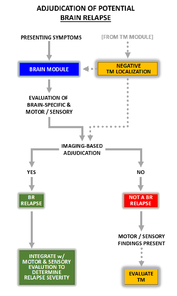

# 9. Relapse Assessment Module: Brain (BR)

## Figure 7.  Summary of Relapse Navigator Brain Adjudication Module  

## 9.1 Overview

Symptomatic brain relapses are uncommon in adults with NMOSD with AQP4-IgG but are often a presenting feature of pediatric disease. The symptoms of a brain relapse are varied and depend upon the number and neuroanatomic distribution of new lesion(s). Generally speaking, such lesions can be divided into cerebral and diencephalic (involving the thalamus or hypothalamus) types.

## 9.2 Cerebral Lesions and Related Symptoms

Cerebral NMOSD lesions affect one or more areas of the supratentorial brain regions, excluding the optic nerves and chiasm and the diencephalon (which is considered separately below). Cerebral lesions often demonstrate an NMOSD-typical pattern with focal or multifocal involvement of the hemispheric white matter, periependymal regions, or the corpus callosum. Resulting symptoms may include specific brain-localizing symptoms such as confusion or alteration of consciousness, language dysfunction, seizure, or homonymous visual field loss. Such symptoms will trigger the Brain relapse module of the **_Relapse Navigator_**.

Cerebral lesions may also cause motor weakness or sensory impairment in the limbs, usually in a hemi-body pattern. If a patient has symptoms suggestive of brain relapse, motor and sensory components that reside in the myelitis module will also be completed and the motor and sensory findings will contribute to the severity assessment of a brain relapse if brain is the final localization.

Involvement of the hypothalamus or thalamus (diencephalon) may cause of variety of symptoms including drowsiness or hypersomnolence, eating disorders, syndrome of inappropriate antidiuretic hormone (SIADH) secretion, or body temperature dysregulation. Acute or subacute involuntary disruption or change in the sleep/wake cycle may manifest as drowsiness or hypersomnolence (irrepressible need to sleep or daytime lapses into sleep without other cause) or narcolepsy (documented by sleep study or observed sleep relapses). The narcolepsy syndrome typically occurs without cataplexy. Anorexia or hyperphagia may occur without APS symptoms. SIADH (serum sodium less than 135 mmol/L with an inappropriately high urinary sodium concentration (typically above 40 mEq/L), hypothermia (&lt;35 degrees Centigrade) or fever (&gt;38 degrees Centigrade) may present clinically with encephalopathy and/or seizures and may be associated with worsening of preexisting focal neurological deficits. In the absence of a systemic infection or other disorder, these symptoms are considered brain-specific and localizing, therefore triggering activation of the Brain module when presented as part of a new clinical event.

## 9.3 Interpretation, Rating, and Clinical Thresholds

The varied clinical presentation of brain involvement in NMOSD requires multidimensional outcome assessments for the identified TNDs. The assessment scales for each of the presentations outlined below were designed with a 4-step rating scale. A one step increase from baseline in an outcome scale associated with the presenting symptoms is sufficient to lead to further evaluation for a relapse.

### 9.3.1 Level of Consciousness (BR2)

0. **Normal** - Alert and responsive

1. **Mild** - Not alert; rousable with verbal or mild tactile stimulation

2. **Moderate** - Not alert; rousable with painful stimuli only

3. **Severe** - Coma; reflex responses only

### 9.3.2 Sleep/Wake Cycle (BR3)

0. **Normal** pattern

1. **Mild** - New hypersomnolence < 12 hours/day OR narcolepsy/sleep attacks but without functional limitations

2. **Moderate** - New hypersomnolence > 12 but < 14 hours/day OR multiple daily narcolepsy/sleep attacks causing some functional limitations (driving, social interaction)

3. **Severe** - New hypersomnolence > 14 hours/day OR frequent narcolepsy/sleep attacks daily restricting usual ADLs

### 9.3.3 Cognitive Function (BR4)

0. **Normal**

1. **Mild** - Patient and/or other witness report mild changes in mentation

2. **Moderate** - Definite abnormalities on brief mental status testing or partially impaired short-term recall, but still oriented to person, place and time

3. **Severe** - Not oriented in one or two spheres (person, place or time), marked effect on lifestyle; marked amnesia evident during conversation or reported by others

### 9.3.4 Aphasia (BR6)

0. **Normal**

1. **Mild** - Mild reduction in fluency and errors but communicates fully

2. **Moderate** - Moderate reduction in fluency and errors with incomplete communication of information

3. **Severe** - Speech fragmented, cannot communicate

### 9.3.5 Visual Fields (BR7)

0. **Normal**

1. **Mild** - Incomplete homonymous hemianopia without significant visual consequences

2. **Moderate** - Incomplete homonymous hemianopia with significant visual consequences (e.g., bumping into door jambs)

3. **Severe** - Complete or near-complete homonymous hemianopia

### 9.3.6 Seizures (BR8)

Occurrence of one or more new (no prior history of similar seizure) focal or generalized seizures in the absence of other persistent CNS symptoms such as encephalopathy, is rated as a moderate relapse. A diagnosis of status epilepticus related to new NMOSD activity is rated as a severe relapse.

### 9.3.7 Eating Disorder, SIADH, Temperature Dysregulation (BR5,BR9,BR10)

The **_Relapse Navigator_** inquires about the presence or absence of anorexia or hyperphagia, SIADH, hypothermia, hyperthermia (see definitions of each in Section 9.2). These symptoms may be isolated or occur concomitantly with other brain syndromes (e.g., encephalopathy). Relapse severity is graded as mild for these syndromes if detected in isolation or combination with each other but moderate to severe events are expected to result in other symptoms such as encephalopathy, grading of which would determine overall relapse severity.

### 9.3.8 Motor Function

Use the motor components of the rating system from the Myelitis module.

### 9.3.9 Sensory Function

Use sensory components of the rating system from the Myelitis module, excluding spinal sensory level evaluation.

## 9.4 Brain Examination Contingencies

Impairment of consciousness or arousal (e.g., drowsiness owing to sleep/wake dysfunction) may be present at the time of clinical examination and confound rating of certain neurological functions that require patient attention and cooperation. The following contingencies are in place to address these situations:

**If** any of the following examination abnormalities are recorded:

* Level of consciousness impairment – level 1 (mild) or level 2 (moderate)
* Sleep/wake dysfunction – level 2 (moderate) or level 3 (severe)

**Then** the rating option of "Indeterminate because of level of consciousness/cognitive impairment" will be added to the following examination elements in the Brain module:

* Aphasia
* Visual Fields
* Eating Disorder
* Muscle strength testing (upper and lower extremities sections)
* Sensory testing (vibration, proprioception, pain/light touch sections)

Examination elements rated as "Indeterminate" will not contribute to the adjudication of change from baseline of that element or the overall adjudication of relapse and relapse severity.

**If** any of the following examination abnormalities are recorded:

* Level of consciousness – level 3 (severe)
* Cognitive dysfunction – level 3 (severe)

**Then** the following fields would be _completely disabled_:

* Aphasia
* Visual Fields
* Eating Disorder
* Muscle strength testing (upper and lower extremities sections)
* Sensory testing (vibration, proprioception, pain/light touch sections)

Rating of the following sections are not affected by these contingencies and should be completed by the examiner:

* Temperature dysregulation
* SIADH
* Seizure

## 9.5 MRI Assessment

Brain MRI assessment is required to confirm a relapse for all cerebral and diencephalic syndrome presentations. The MRI must detect one or more new/enlarging T2 lesions or one or more Gd-enhancing T1 lesions in regions that are consistent with the new symptoms. The lesions must be deemed compatible with NMOSD after satisfactory exclusion of potential etiologies such as infection, stroke, neoplasm, and other causes. MRI indicators of indirect effects of NMOSD lesions (e.g., hydrocephalus due to aqueductal stenosis) do not support a diagnosis of an NMOSD relapse.

## 9.6 Integration of Symptoms, Examination Thresholds and MRI Findings

Acute or subacute cerebral or diencephalic symptoms must last at least 24 hours and be accompanied by detection of a brain MRI lesion compatible with the clinical findings. Given the additional lack of etiologic specificity of isolated anorexic symptoms, symptoms of an eating disorder should be persistent for 48 hours and indicators of other potential etiologies should be absent.

Thus, the following are required to make a diagnosis of an anorexic hypothalamic syndrome:

1. Acute or subacute anorexia persisting ≥48 hours\*
2. Exclusion of other etiology\*\*
3. Explanatory new T2 or enhancing hypothalamic MRI lesion demonstrated

\* Shorter duration of symptoms would be considered as a relapse if MRI shows new hypothalamic involvement

\*\*metabolic, gastrointestinal, infectious, biochemical, CNS lesion/tumor, classic migraine or psychiatric eating disorders.

## 9.7 Brain Relapse Severity Scoring

Relapse severity is graded as mild, moderate, or severe based on change from baseline for the TND. A 1-point change on any single element results in relapse severity categorization as mild, a 2-point change moderate and 3-point change severe. In the event that more than one subsystem is affected, the following would apply for assessment of severity grade:

* Mild relapse: one or two grades 1
* Moderate relapse: one or two grades 2; OR 3 or more grades 1
* Severe relapse: one or more grades 3; OR three or more grades 2

For brain relapses that include motor and/or sensory dysfunction in the limbs and where the MRI lesion(s) that confirm the brain relapse explain all or part of any detected motor or sensory examination changes, the summary motor and sensory change scores are integrated into the determination of overall brain relapse severity. For example, if a patient had language dysfunction and right leg weakness with brain MRI confirming a new brain lesion that explained the symptoms, then the aphasia subsystem change score (ranging from no change to severe) would be combined with the overall motor change score as described in the spinal cord module (ranging from no change to severe). In this example, a mild aphasia subsystem score and a moderate motor weakness change score would result in adjudication of a relapse of moderate severity.
